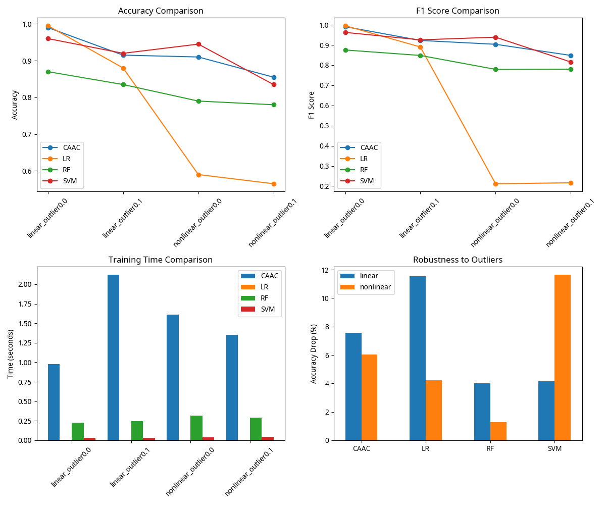

# CAAC - Cauchy Abduction Action Classification

> 基于柯西分布的因果推断分类模型

## 项目简介

CAAC-SPSFT（Cauchy Abduction Action Classification with Stochastic Pathway Selection and Fixed Thresholds）是一种基于柯西分布的因果推断分类模型，是对CAAR（Cauchy Abduction Action Regression）回归模型的扩展。该模型保留了柯西分布的重尾特性和因果解释性，同时引入了固定阈值机制和多路径混合策略，确保机制不变性。

## 核心特点

- **因果表征**：通过柯西分布建模潜在变量，提高模型对异常值的鲁棒性
- **机制不变性**：输入数据仅影响因果表征生成，而因果表征到分类结果的映射机制是固定的
- **多路径混合**：通过多条并行的"解读路径"增强模型表达能力
- **固定阈值**：全局固定的分类阈值确保机制不变性

## 快速开始

```bash
# 克隆仓库
git clone https://github.com/1587causalai/caac.git
cd caac

# 安装依赖
pip install -r requirements.txt

# 运行实验
python run_experiments.py
```

## 实验结果

CAAC-SPSFT模型在多种数据集上（线性/非线性，有/无异常值）与基线方法（逻辑回归、随机森林、SVM）进行了比较，展现出优秀的性能和鲁棒性。



## 更多内容

- [理论设计](theory.md)
- [合成数据实验](experiments_synthetic.md)
- [真实数据实验](experiments_real.md)
- [API文档](api.md)
