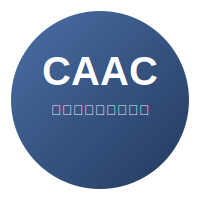

<!-- _coverpage.md -->

<!-- # CAAC <small>v1.2</small> -->

> 🧠 基于共享潜在柯西向量的推断行动 One-vs-Rest 多分类器

**🎯 新一代机器学习分类器**

- ✨ **厚尾鲁棒性** - 柯西分布对异常值的天然抵抗力
- 🔗 **智能关联** - 共享潜在向量捕捉类别间相关性  
- 🚀 **高效扩展** - OvR策略支持大规模分类任务
- 📊 **精确量化** - 显式建模决策不确定性

[🚀 立即开始](tutorials/quickstart.md)
[📚 查看文档](theory/motivation.md)
[💻 GitHub仓库](https://github.com/1587causalai/caac)

<!-- 背景色: 浅蓝色 -->
  
