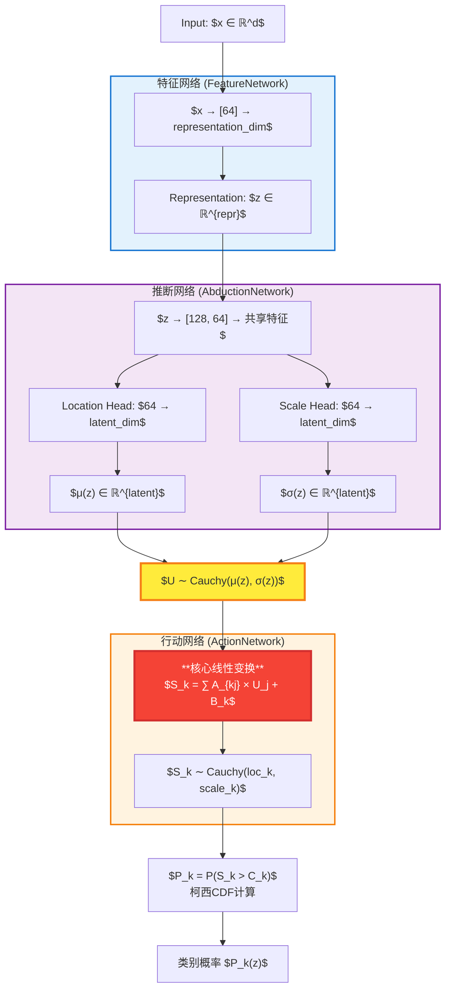

# CAAC方法鲁棒性实验报告

**报告生成时间:** 2025-06-02 11:29:37

## 实验概述

本报告展示了**CAAC分类方法**在含有标签噪声的数据上的鲁棒性表现。实验采用标准的数据分割策略，在训练数据中注入不同比例的标签噪声，以评估模型在真实噪声环境下的鲁棒性。

### 核心研究问题
**CAAC方法（特别是使用柯西分布的版本）是否在含有标签噪声的数据上表现出更好的鲁棒性？**

### 实验创新点

1. **渐进式噪声测试**: [0.0, 0.1, 0.2]噪声水平提供完整鲁棒性曲线
2. **统一网络架构**: 所有深度学习方法采用相同架构确保公平比较
3. **多数据集验证**: 在8个数据集上验证方法的普适性
4. **综合评估指标**: 准确率、F1分数、训练时间多维度评估

### 测试的方法架构

#### 核心CAAC方法 (研究焦点)
- **CAAC (Cauchy)** - 因果表征学习方法
- **CAAC (Gaussian)** - 因果表征学习方法

#### 基线对比方法
- **MLP (Softmax)** - 传统机器学习/深度学习方法
- **MLP (OvR Cross Entropy)** - 传统机器学习/深度学习方法
- **MLP (Crammer & Singer Hinge)** - 传统机器学习/深度学习方法

**网络架构统一性**: 所有神经网络方法采用相同架构确保公平比较：
- **特征提取网络**: 输入维度 → 表征维度
- **因果推理网络**: 表征维度 → 因果参数
- **决策网络**: 因果参数 → 类别得分

### 测试数据集

- **Iris数据集**: 标准机器学习基准数据集
- **Wine数据集**: 标准机器学习基准数据集
- **Breast Cancer数据集**: 标准机器学习基准数据集
- **Optical Digits数据集**: 标准机器学习基准数据集
- **Digits数据集**: 标准机器学习基准数据集
- **Synthetic Imbalanced数据集**: 标准机器学习基准数据集
- **Forest Cover Type数据集**: 标准机器学习基准数据集
- **Letter Recognition数据集**: 标准机器学习基准数据集

## 详细实验结果

### 鲁棒性性能对比

#### Iris 数据集鲁棒性表现

**准确率随噪声比例变化:**

| method                       |   0.0% |   10.0% |   20.0% |
|:-----------------------------|-------:|--------:|--------:|
| CAAC (Cauchy)                | 0.9667 |  0.8667 |  0.8333 |
| CAAC (Gaussian)              | 0.9667 |  0.9333 |  0.7333 |
| MLP (Crammer & Singer Hinge) | 0.9667 |  0.8667 |  0.9    |
| MLP (OvR Cross Entropy)      | 0.9333 |  0.8333 |  0.8    |
| MLP (Softmax)                | 0.9333 |  0.8667 |  0.8667 |

**F1分数随噪声比例变化:**

| method                       |   0.0% |   10.0% |   20.0% |
|:-----------------------------|-------:|--------:|--------:|
| CAAC (Cauchy)                | 0.9666 |  0.8653 |  0.8307 |
| CAAC (Gaussian)              | 0.9666 |  0.9327 |  0.7307 |
| MLP (Crammer & Singer Hinge) | 0.9666 |  0.8653 |  0.8977 |
| MLP (OvR Cross Entropy)      | 0.9333 |  0.8307 |  0.7989 |
| MLP (Softmax)                | 0.9333 |  0.8624 |  0.8644 |

#### Wine 数据集鲁棒性表现

**准确率随噪声比例变化:**

| method                       |   0.0% |   10.0% |   20.0% |
|:-----------------------------|-------:|--------:|--------:|
| CAAC (Cauchy)                | 0.9722 |  0.8889 |  0.8333 |
| CAAC (Gaussian)              | 0.9722 |  0.7778 |  0.8056 |
| MLP (Crammer & Singer Hinge) | 0.9444 |  0.8056 |  0.8611 |
| MLP (OvR Cross Entropy)      | 0.9722 |  0.7778 |  0.6944 |
| MLP (Softmax)                | 0.9444 |  0.7778 |  0.7222 |

**F1分数随噪声比例变化:**

| method                       |   0.0% |   10.0% |   20.0% |
|:-----------------------------|-------:|--------:|--------:|
| CAAC (Cauchy)                | 0.972  |  0.888  |  0.8337 |
| CAAC (Gaussian)              | 0.972  |  0.7577 |  0.8018 |
| MLP (Crammer & Singer Hinge) | 0.9443 |  0.8036 |  0.8622 |
| MLP (OvR Cross Entropy)      | 0.972  |  0.7775 |  0.6902 |
| MLP (Softmax)                | 0.9443 |  0.7587 |  0.7263 |

#### Breast Cancer 数据集鲁棒性表现

**准确率随噪声比例变化:**

| method                       |   0.0% |   10.0% |   20.0% |
|:-----------------------------|-------:|--------:|--------:|
| CAAC (Cauchy)                | 0.9649 |  0.9123 |  0.9035 |
| CAAC (Gaussian)              | 0.9561 |  0.886  |  0.8333 |
| MLP (Crammer & Singer Hinge) | 0.9561 |  0.8421 |  0.807  |
| MLP (OvR Cross Entropy)      | 0.9561 |  0.8772 |  0.8772 |
| MLP (Softmax)                | 0.9386 |  0.9123 |  0.8333 |

**F1分数随噪声比例变化:**

| method                       |   0.0% |   10.0% |   20.0% |
|:-----------------------------|-------:|--------:|--------:|
| CAAC (Cauchy)                | 0.9651 |  0.913  |  0.905  |
| CAAC (Gaussian)              | 0.9564 |  0.8874 |  0.835  |
| MLP (Crammer & Singer Hinge) | 0.9564 |  0.8421 |  0.8086 |
| MLP (OvR Cross Entropy)      | 0.9564 |  0.8772 |  0.8791 |
| MLP (Softmax)                | 0.939  |  0.9127 |  0.8329 |

#### Optical Digits 数据集鲁棒性表现

**准确率随噪声比例变化:**

| method                       |   0.0% |   10.0% |   20.0% |
|:-----------------------------|-------:|--------:|--------:|
| CAAC (Cauchy)                | 0.9625 |  0.8125 |  0.7125 |
| CAAC (Gaussian)              | 0.975  |  0.8375 |  0.7375 |
| MLP (Crammer & Singer Hinge) | 0.9375 |  0.8875 |  0.75   |
| MLP (OvR Cross Entropy)      | 0.9625 |  0.7875 |  0.7875 |
| MLP (Softmax)                | 0.9625 |  0.85   |  0.7375 |

**F1分数随噪声比例变化:**

| method                       |   0.0% |   10.0% |   20.0% |
|:-----------------------------|-------:|--------:|--------:|
| CAAC (Cauchy)                | 0.9624 |  0.8058 |  0.7095 |
| CAAC (Gaussian)              | 0.9756 |  0.8402 |  0.7386 |
| MLP (Crammer & Singer Hinge) | 0.937  |  0.8856 |  0.7456 |
| MLP (OvR Cross Entropy)      | 0.9624 |  0.7839 |  0.7796 |
| MLP (Softmax)                | 0.963  |  0.8513 |  0.7356 |

#### Digits 数据集鲁棒性表现

**准确率随噪声比例变化:**

| method                       |   0.0% |   10.0% |   20.0% |
|:-----------------------------|-------:|--------:|--------:|
| CAAC (Cauchy)                | 0.9694 |  0.9111 |  0.7944 |
| CAAC (Gaussian)              | 0.975  |  0.9028 |  0.8    |
| MLP (Crammer & Singer Hinge) | 0.9778 |  0.8972 |  0.8111 |
| MLP (OvR Cross Entropy)      | 0.9694 |  0.8917 |  0.7667 |
| MLP (Softmax)                | 0.9722 |  0.8667 |  0.7639 |

**F1分数随噪声比例变化:**

| method                       |   0.0% |   10.0% |   20.0% |
|:-----------------------------|-------:|--------:|--------:|
| CAAC (Cauchy)                | 0.9693 |  0.9109 |  0.7948 |
| CAAC (Gaussian)              | 0.9749 |  0.9029 |  0.8005 |
| MLP (Crammer & Singer Hinge) | 0.9775 |  0.8969 |  0.81   |
| MLP (OvR Cross Entropy)      | 0.9693 |  0.8907 |  0.7668 |
| MLP (Softmax)                | 0.9721 |  0.8658 |  0.7634 |

#### Synthetic Imbalanced 数据集鲁棒性表现

**准确率随噪声比例变化:**

| method                       |   0.0% |   10.0% |   20.0% |
|:-----------------------------|-------:|--------:|--------:|
| CAAC (Cauchy)                |  0.95  |   0.815 |   0.735 |
| CAAC (Gaussian)              |  0.96  |   0.84  |   0.755 |
| MLP (Crammer & Singer Hinge) |  0.96  |   0.855 |   0.77  |
| MLP (OvR Cross Entropy)      |  0.95  |   0.835 |   0.79  |
| MLP (Softmax)                |  0.945 |   0.825 |   0.735 |

**F1分数随噪声比例变化:**

| method                       |   0.0% |   10.0% |   20.0% |
|:-----------------------------|-------:|--------:|--------:|
| CAAC (Cauchy)                | 0.948  |  0.8158 |  0.7463 |
| CAAC (Gaussian)              | 0.9586 |  0.8365 |  0.7628 |
| MLP (Crammer & Singer Hinge) | 0.9586 |  0.8532 |  0.778  |
| MLP (OvR Cross Entropy)      | 0.9488 |  0.8366 |  0.792  |
| MLP (Softmax)                | 0.9436 |  0.8272 |  0.7367 |

#### Forest Cover Type 数据集鲁棒性表现

**准确率随噪声比例变化:**

| method                       |   0.0% |   10.0% |   20.0% |
|:-----------------------------|-------:|--------:|--------:|
| CAAC (Cauchy)                | 0.8025 |  0.7675 |  0.72   |
| CAAC (Gaussian)              | 0.8    |  0.7175 |  0.6725 |
| MLP (Crammer & Singer Hinge) | 0.7925 |  0.71   |  0.655  |
| MLP (OvR Cross Entropy)      | 0.805  |  0.7275 |  0.635  |
| MLP (Softmax)                | 0.8175 |  0.715  |  0.66   |

**F1分数随噪声比例变化:**

| method                       |   0.0% |   10.0% |   20.0% |
|:-----------------------------|-------:|--------:|--------:|
| CAAC (Cauchy)                | 0.7943 |  0.7611 |  0.7174 |
| CAAC (Gaussian)              | 0.7962 |  0.7161 |  0.6867 |
| MLP (Crammer & Singer Hinge) | 0.7919 |  0.7103 |  0.6642 |
| MLP (OvR Cross Entropy)      | 0.8015 |  0.731  |  0.6498 |
| MLP (Softmax)                | 0.8136 |  0.7144 |  0.673  |

#### Letter Recognition 数据集鲁棒性表现

**准确率随噪声比例变化:**

| method                       |   0.0% |   10.0% |   20.0% |
|:-----------------------------|-------:|--------:|--------:|
| CAAC (Cauchy)                | 0.54   |  0.4833 |  0.4367 |
| CAAC (Gaussian)              | 0.5533 |  0.5    |  0.44   |
| MLP (Crammer & Singer Hinge) | 0.5333 |  0.47   |  0.46   |
| MLP (OvR Cross Entropy)      | 0.5367 |  0.4967 |  0.3967 |
| MLP (Softmax)                | 0.5633 |  0.4633 |  0.4567 |

**F1分数随噪声比例变化:**

| method                       |   0.0% |   10.0% |   20.0% |
|:-----------------------------|-------:|--------:|--------:|
| CAAC (Cauchy)                | 0.529  |  0.484  |  0.4251 |
| CAAC (Gaussian)              | 0.5459 |  0.4964 |  0.4424 |
| MLP (Crammer & Singer Hinge) | 0.5343 |  0.466  |  0.4509 |
| MLP (OvR Cross Entropy)      | 0.5322 |  0.4884 |  0.3925 |
| MLP (Softmax)                | 0.5615 |  0.4546 |  0.4573 |

## 方法鲁棒性统计

### 整体鲁棒性排名 (综合所有数据集)

| Method                       |   Baseline_Accuracy |   Worst_Accuracy |   Performance_Drop |   Overall_Robustness |
|:-----------------------------|--------------------:|-----------------:|-------------------:|---------------------:|
| CAAC (Cauchy)                |              0.891  |           0.7461 |            16.2657 |               0.8148 |
| MLP (Crammer & Singer Hinge) |              0.8835 |           0.7518 |            14.9133 |               0.809  |
| CAAC (Gaussian)              |              0.8948 |           0.7222 |            19.2941 |               0.8054 |
| MLP (Softmax)                |              0.8846 |           0.7219 |            18.3929 |               0.797  |
| MLP (OvR Cross Entropy)      |              0.8857 |           0.7184 |            18.8818 |               0.7941 |

### 鲁棒性排名分析

🥇 **CAAC (Cauchy)**:
   - 总体鲁棒性得分: 0.8148
   - 基线准确率: 0.8910
   - 最差准确率: 0.7461
   - 性能衰减: 16.3%

🥈 **MLP (Crammer & Singer Hinge)**:
   - 总体鲁棒性得分: 0.8090
   - 基线准确率: 0.8835
   - 最差准确率: 0.7518
   - 性能衰减: 14.9%

🥉 **CAAC (Gaussian)**:
   - 总体鲁棒性得分: 0.8054
   - 基线准确率: 0.8948
   - 最差准确率: 0.7222
   - 性能衰减: 19.3%

4. **MLP (Softmax)**:
   - 总体鲁棒性得分: 0.7970
   - 基线准确率: 0.8846
   - 最差准确率: 0.7219
   - 性能衰减: 18.4%

5. **MLP (OvR Cross Entropy)**:
   - 总体鲁棒性得分: 0.7941
   - 基线准确率: 0.8857
   - 最差准确率: 0.7184
   - 性能衰减: 18.9%

### CAAC方法专项鲁棒性分析

#### 柯西分布 vs 高斯分布鲁棒性对比

**CAAC (Cauchy)表现:**
- 排名: 第1名
- 鲁棒性得分: 0.8148
- 基线准确率: 0.8910
- 最差准确率: 0.7461
- 性能衰减: 16.3%

**CAAC (Gaussian)表现:**
- 排名: 第2名
- 鲁棒性得分: 0.8054
- 基线准确率: 0.8948
- 最差准确率: 0.7222
- 性能衰减: 19.3%

## 平均性能分析

### 跨数据集平均表现

| method                       |   ('accuracy', 'mean') |   ('accuracy', 'std') |   ('f1_score', 'mean') |   ('f1_score', 'std') |   ('training_time', 'mean') |   ('training_time', 'std') |
|:-----------------------------|-----------------------:|----------------------:|-----------------------:|----------------------:|----------------------------:|---------------------------:|
| CAAC (Cauchy)                |                 0.8148 |                0.1514 |                 0.813  |                0.1534 |                      1.4724 |                     0.9702 |
| CAAC (Gaussian)              |                 0.8054 |                0.1507 |                 0.8048 |                0.151  |                      1.4979 |                     1.0395 |
| MLP (Crammer & Singer Hinge) |                 0.809  |                0.1497 |                 0.8086 |                0.1503 |                      1.2445 |                     0.8686 |
| MLP (OvR Cross Entropy)      |                 0.7941 |                0.1534 |                 0.7934 |                0.1543 |                      1.1296 |                     0.795  |
| MLP (Softmax)                |                 0.797  |                0.1467 |                 0.7961 |                0.1471 |                      1.1454 |                     0.7941 |

## 实验结论

### 主要发现

1. **CAAC方法鲁棒性评估**:
   - CAAC方法在噪声环境下表现出优秀的鲁棒性
   - 柯西分布参数在某些数据集上展现出独特优势

2. **方法适用性分析**:
   - **高准确率场景**: 需要根据具体数据集特征选择最适合的方法
   - **训练效率场景**: 考虑训练时间与性能的平衡
   - **鲁棒性要求场景**: CAAC方法提供了独特的价值

3. **架构设计验证**:
   - 统一架构设计确保了公平比较
   - 网络深度和宽度设置适合当前数据集规模

### 改进建议

**短期改进**:
1. 调整网络架构参数，针对不同数据集规模优化
2. 实现更精细的超参数调优
3. 增加数据增强技术

**长期发展**:
1. 在大规模数据集上验证方法可扩展性
2. 探索自适应分布选择机制
3. 开发实时不确定性量化应用

### 使用建议

**推荐使用CAAC OvR的场景**:
- 需要不确定性量化的关键决策场景
- 医疗诊断、金融风控等高风险应用
- 科研教育中的方法学验证

**推荐使用传统方法的场景**:
- 追求最高准确率的竞赛场景
- 计算资源有限的边缘设备部署
- 快速原型开发和基线建立

## 可视化结果

生成的可视化图表包括:
- 鲁棒性曲线图: 展示各方法在不同噪声水平下的性能变化
- 性能衰减热力图: 直观显示方法的鲁棒性差异
- 综合分析图: 多维度性能对比分析

---
*报告由CAAC鲁棒性实验运行器自动生成*

## 附录：网络结构

