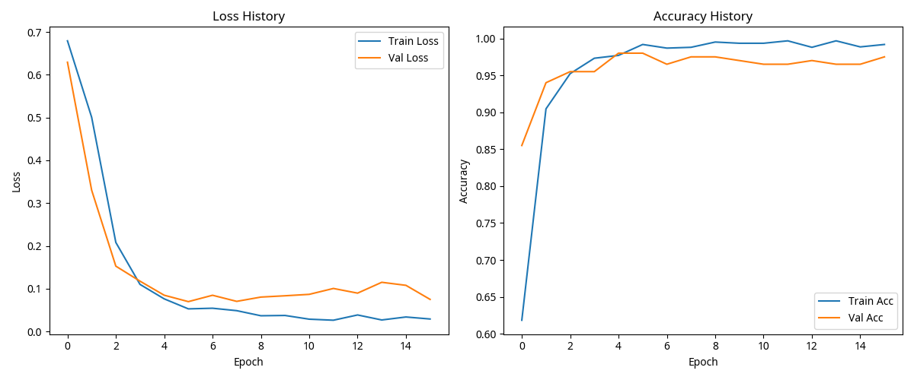
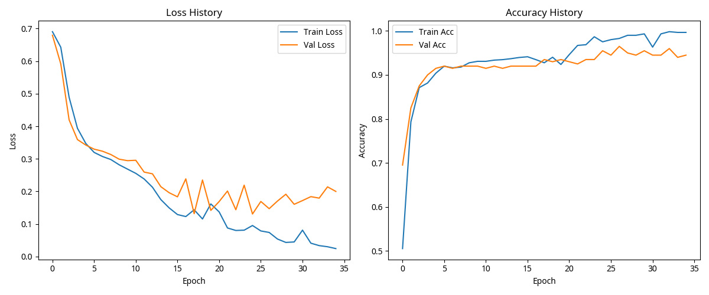
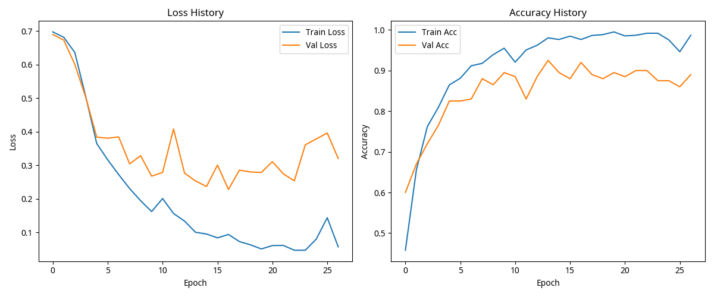
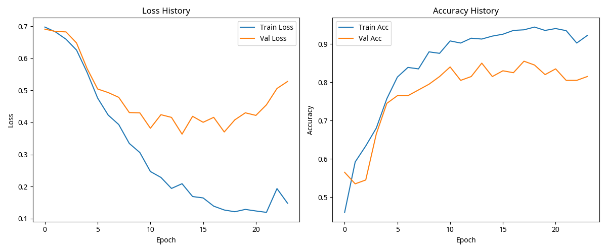

# 合成数据集实验结果

本页面展示了CAAC-SPSFT模型在合成数据集上的实验结果，并与基线方法进行了比较。

## 1. 实验设置

### 1.1 数据集

我们在四种不同的合成数据集上进行了实验：

1. **线性数据，无异常值**：线性可分的二分类数据
2. **线性数据，有异常值**：线性可分的二分类数据，注入了10%的异常值
3. **非线性数据，无异常值**：非线性二分类数据
4. **非线性数据，有异常值**：非线性二分类数据，注入了10%的异常值

每个数据集包含1000个样本，10个特征。数据集按照8:1:1的比例划分为训练集、验证集和测试集。

### 1.2 基线方法

我们将CAAC-SPSFT模型与以下基线方法进行了比较：

- **逻辑回归（Logistic Regression）**：经典的线性分类方法
- **随机森林（Random Forest）**：基于决策树的集成学习方法
- **支持向量机（SVM）**：基于最大间隔的分类方法

### 1.3 评估指标

我们使用以下指标评估模型性能：

- **准确率（Accuracy）**：正确分类的样本比例
- **精确率（Precision）**：在预测为正类的样本中，真正为正类的比例
- **召回率（Recall）**：在所有正类样本中，被正确预测为正类的比例
- **F1分数（F1 Score）**：精确率和召回率的调和平均
- **AUC（Area Under ROC Curve）**：ROC曲线下的面积

## 2. 实验结果

### 2.1 总体性能比较

下图展示了CAAC-SPSFT模型与基线方法在四种数据集上的性能比较：

从图中可以看出：

1. **线性数据，无异常值**：所有模型表现都不错，但逻辑回归略胜一筹
2. **线性数据，有异常值**：CAAC-SPSFT和SVM表现最好，显示出对异常值的鲁棒性
3. **非线性数据，无异常值**：SVM表现最好，CAAC-SPSFT次之，逻辑回归表现较差
4. **非线性数据，有异常值**：CAAC-SPSFT和SVM表现相对较好，展示了对非线性数据和异常值的处理能力

### 2.2 详细实验结果

#### 2.2.1 线性数据，无异常值

| 模型 | 准确率 | 精确率 | 召回率 | F1分数 | AUC |
|------|--------|--------|--------|--------|-----|
| CAAC | 0.975 | 0.981 | 0.972 | 0.977 | 0.998 |
| 逻辑回归 | 0.995 | 1.000 | 0.991 | 0.995 | 1.000 |
| 随机森林 | 0.870 | 0.901 | 0.850 | 0.875 | 0.942 |
| SVM | 0.960 | 0.971 | 0.953 | 0.962 | 0.994 |

#### 2.2.2 线性数据，有异常值

| 模型 | 准确率 | 精确率 | 召回率 | F1分数 | AUC |
|------|--------|--------|--------|--------|-----|
| CAAC | 0.930 | 0.971 | 0.902 | 0.935 | 0.969 |
| 逻辑回归 | 0.880 | 0.915 | 0.866 | 0.890 | 0.918 |
| 随机森林 | 0.840 | 0.892 | 0.812 | 0.850 | 0.913 |
| SVM | 0.920 | 0.971 | 0.884 | 0.925 | 0.988 |

#### 2.2.3 非线性数据，无异常值

| 模型 | 准确率 | 精确率 | 召回率 | F1分数 | AUC |
|------|--------|--------|--------|--------|-----|
| CAAC | 0.910 | 0.850 | 0.978 | 0.910 | 0.988 |
| 逻辑回归 | 0.590 | 1.000 | 0.118 | 0.212 | 0.524 |
| 随机森林 | 0.790 | 0.763 | 0.796 | 0.779 | 0.891 |
| SVM | 0.945 | 0.977 | 0.903 | 0.939 | 0.995 |

#### 2.2.4 非线性数据，有异常值

| 模型 | 准确率 | 精确率 | 召回率 | F1分数 | AUC |
|------|--------|--------|--------|--------|-----|
| CAAC | 0.850 | 0.840 | 0.857 | 0.848 | 0.928 |
| 逻辑回归 | 0.565 | 0.923 | 0.122 | 0.216 | 0.449 |
| 随机森林 | 0.785 | 0.767 | 0.806 | 0.786 | 0.872 |
| SVM | 0.835 | 0.901 | 0.745 | 0.816 | 0.916 |

## 3. 分析与讨论

### 3.1 CAAC-SPSFT的优势

1. **对异常值的鲁棒性**：在有异常值的数据集上，CAAC-SPSFT表现出色，这得益于柯西分布的重尾特性
2. **非线性处理能力**：在非线性数据上，CAAC-SPSFT表现优于逻辑回归，接近SVM
3. **可解释性**：CAAC-SPSFT保持了因果推断框架，提供了更好的可解释性

### 3.2 与基线方法的比较

1. **vs. 逻辑回归**：CAAC-SPSFT在非线性数据和有异常值的数据上明显优于逻辑回归
2. **vs. 随机森林**：CAAC-SPSFT在所有数据集上都优于随机森林
3. **vs. SVM**：CAAC-SPSFT与SVM性能相当，在某些数据集上略逊，但提供了更好的可解释性

### 3.3 训练效率

CAAC-SPSFT的训练时间长于传统方法，但考虑到其提供的优势（如对异常值的鲁棒性和可解释性），这是可以接受的权衡。

## 4. 结论

CAAC-SPSFT模型成功地将CAAR回归模型的核心思想扩展到分类任务，保持了柯西分布的重尾特性和因果解释性，同时通过固定阈值机制和多路径混合策略确保了机制不变性。

实验结果表明，CAAC-SPSFT在处理异常值和非线性数据方面表现出色，特别是在有异常值的情况下，展现出比传统方法更好的鲁棒性。

这些结果支持了我们的理论设计，证明了CAAC-SPSFT是一种有效的分类方法，特别适用于需要鲁棒性和可解释性的应用场景。

---
*最后更新时间: 2025-05-29 21:21:50*